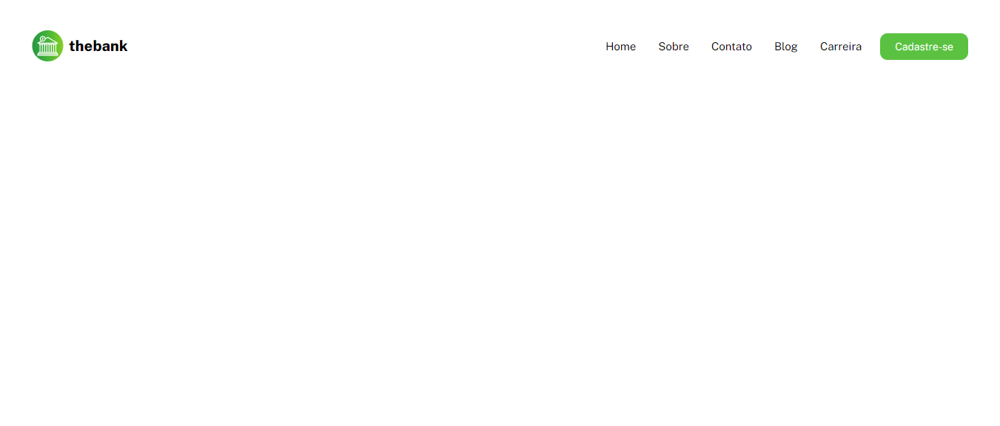
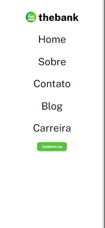

# Projeto Profile Card 🎴

### Desafio do curso DevQuest onde o principal objetivo é construir um menu responsivo usando o modelo do Figma.

#

## Design Desktop

[]

## Design Mobile

[]

## Tecnologia utilizadas:

- HTML
- CSS